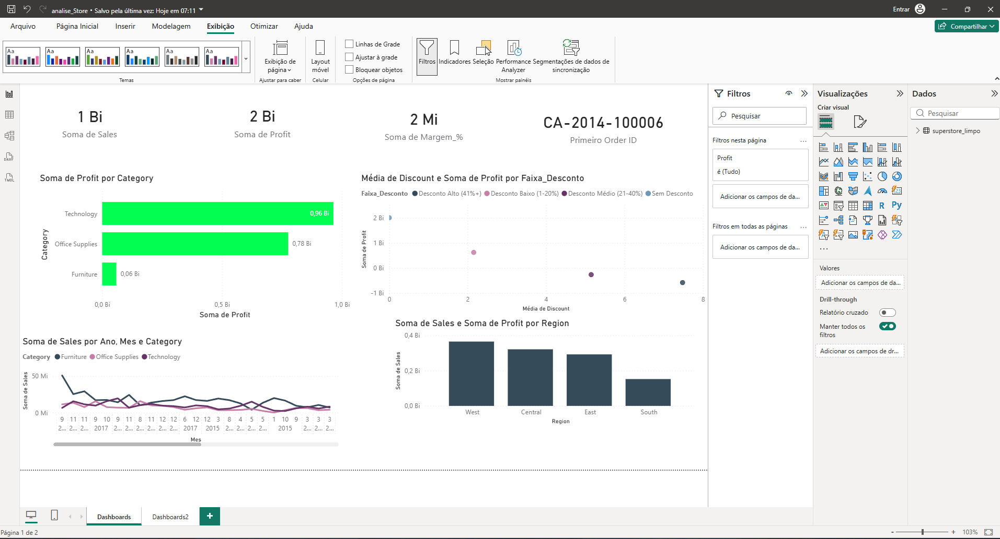
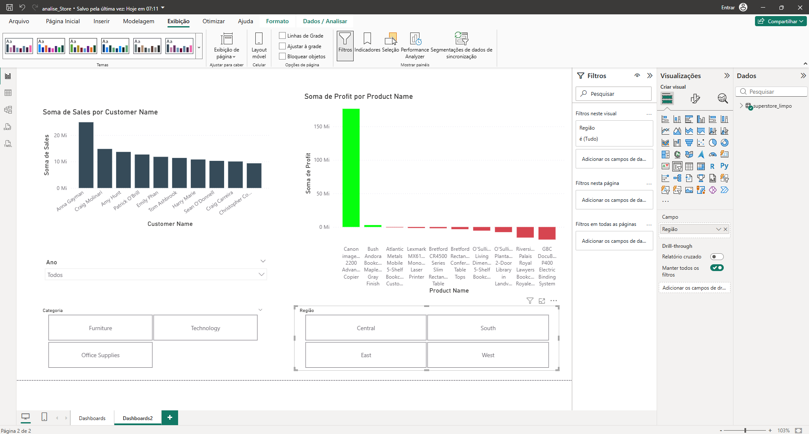

# 📊 Análise de Vendas — Superstore

> 🎓 **Projeto de aprendizado** — desenvolvido para praticar o pipeline completo de dados com Python e dar os primeiros passos com Power BI.

---

## 🌱 Sobre este Projeto

Este projeto foi criado com o objetivo de **aprender na prática** como funciona um processo real de análise de dados — desde o arquivo bruto até um dashboard interativo no Power BI.

O dataset utilizado é o **Sample Superstore**, clássico em estudos de BI, que simula pedidos de uma rede varejista americana com dados de vendas, lucro, desconto, região e categoria de produto.

> 💬 _"Aprendo melhor colocando a mão na massa. Por isso resolvi pegar um dataset real, sujar as mãos com Python e construir algo visual no Power BI."_

---

## 🎯 O que eu queria aprender

- ✅ Como **carregar e inspecionar** um dataset com Pandas
- ✅ Como identificar e tratar **problemas reais nos dados** (duplicatas, nulos, tipos errados)
- ✅ Como **criar novas colunas** que agregam valor à análise
- ✅ Como fazer **análise exploratória (EDA)** e responder perguntas de negócio
- ✅ Como gerar **gráficos profissionais** com Matplotlib e Seaborn
- ✅ Como **exportar dados tratados** e importar no Power BI
- ✅ Como construir um **dashboard interativo com múltiplas páginas** no Power BI Desktop

---

## 🗂️ Estrutura do Projeto

```
AnaliseDados/
│
├── 📄 Sample - Superstore.csv       # Dataset original (9.994 registros)
├── 📄 superstore_limpo.csv          # Dataset após limpeza e enriquecimento
│
├── 🐍 preparar_para_powerbi.py      # Etapa 1 — Limpeza e preparação dos dados
├── 🐍 analise_superstore.py         # Etapa 2 — Análise exploratória + gráficos
│
├── 📊 analise_Store.pbix            # Dashboard interativo no Power BI
│
└── 📁 prints/
    ├── dashboard1.png               # Print — Página 1: visão geral de vendas
    └── dashboard2.png               # Print — Página 2: análise por cliente e produto
```

---

## 🐍 Etapa 1 — Limpeza e Preparação dos Dados

**Script:** `preparar_para_powerbi.py`

Antes de qualquer análise ou visualização, os dados precisam estar confiáveis. Esta etapa foi onde aprendi que **dados brutos raramente estão prontos para uso**.

### 📥 Carregamento

```python
df = pd.read_csv(ARQUIVO_ENTRADA, encoding='latin1')
# Resultado: 9.994 linhas | 21 colunas
```

O parâmetro `encoding='latin1'` foi necessário porque o arquivo contém caracteres especiais que o encoding padrão (UTF-8) não consegue ler — erro comum em arquivos gerados no Windows.

---

### 🧹 Limpeza dos dados

**2.1 — Remoção de duplicatas**
```python
antes = len(df)
df = df.drop_duplicates()
depois = len(df)
```
Verificar duplicatas é sempre o primeiro passo. Linhas repetidas distorcem qualquer métrica de soma ou média.

**2.2 — Conversão de tipos de data**
```python
df['Order Date'] = pd.to_datetime(df['Order Date'])
df['Ship Date']  = pd.to_datetime(df['Ship Date'])
```
O CSV armazena datas como texto (string). Convertê-las para `datetime` permite subtrair datas, extrair mês/ano e ordenar cronologicamente.

**2.3 — Verificação de valores nulos**
```python
nulos = df.isnull().sum().sum()
```
Contamos o total de valores ausentes em todas as colunas. Nulos em colunas numéricas geram erros em cálculos; em colunas de texto, quebram agrupamentos.

**2.4 — Padronização de texto**
```python
colunas_texto = df.select_dtypes(include='object').columns
for col in colunas_texto:
    df[col] = df[col].str.strip()
```
Espaços invisíveis fazem com que `"West"` e `"West "` sejam tratados como categorias diferentes. O `.str.strip()` remove esses espaços em todas as colunas de texto de uma vez.

---

### ✨ Enriquecimento — Novas colunas para o Power BI

Após a limpeza, criei colunas derivadas que tornam a análise muito mais rica:

**3.1 — Decomposição temporal**
```python
df['Ano']       = df['Order Date'].dt.year
df['Mes']       = df['Order Date'].dt.month
df['Mes_Nome']  = df['Order Date'].dt.strftime('%B')
df['Trimestre'] = df['Order Date'].dt.quarter.map({1:'Q1', 2:'Q2', 3:'Q3', 4:'Q4'})
```
Com essas colunas, o Power BI consegue criar filtros de período sem precisar de fórmulas DAX complexas.

**3.2 — Dias para envio**
```python
df['Dias_Envio'] = (df['Ship Date'] - df['Order Date']).dt.days
```
Subtração direta entre duas datas — só funciona porque convertemos para `datetime` anteriormente. Permite medir a eficiência logística.

**3.3 — Margem de lucro por pedido**
```python
df['Margem_%'] = (df['Profit'] / df['Sales'] * 100).round(2)
```
Transforma o lucro absoluto em percentual, permitindo comparar pedidos de valores muito diferentes de forma justa.

**3.4 — Faixa de desconto**
```python
df['Faixa_Desconto'] = pd.cut(
    df['Discount'],
    bins=[-0.01, 0, 0.2, 0.4, 1.0],
    labels=['Sem Desconto', 'Desconto Baixo (1-20%)', 'Desconto Médio (21-40%)', 'Desconto Alto (41%+)']
)
```
O `pd.cut()` transforma um valor contínuo em categorias (faixas), facilitando filtros e análises no dashboard.

**3.5 — Status de lucro**
```python
df['Status_Lucro'] = df['Profit'].apply(
    lambda x: 'Lucrativo' if x > 0 else 'Prejuízo'
)
```
Classificação binária por pedido — útil para criar KPIs e indicadores visuais no Power BI.

**3.6 — Ticket total por pedido**
```python
ticket = df.groupby('Order ID')['Sales'].sum().reset_index()
ticket.columns = ['Order ID', 'Ticket_Total_Pedido']
df = df.merge(ticket, on='Order ID', how='left')
```
Como um pedido pode ter vários produtos (várias linhas no CSV), agrupamos por `Order ID`, somamos e fazemos um `merge` para trazer o total de volta para cada linha.

---

### 🔍 Filtros de qualidade

```python
df = df[df['Sales'] > 0]        # Remove vendas zeradas ou negativas
df = df[df['Dias_Envio'] >= 0]  # Remove datas de envio inválidas
```

Registros inconsistentes como `Sales <= 0` ou `Dias_Envio < 0` são erros de sistema que distorceriam médias e totais.

---

### 📤 Exportação

```python
df.to_csv(ARQUIVO_SAIDA, index=False, encoding='utf-8-sig')
```

O encoding `utf-8-sig` garante que o Power BI (e o Excel) abram o arquivo sem problemas de acentuação — detalhe que faz diferença na prática.

---

## 🔎 Etapa 2 — Análise Exploratória de Dados (EDA)

**Script:** `analise_superstore.py`

Com os dados limpos, parti para responder perguntas de negócio e gerar visualizações.

### 📋 Exploração inicial

```python
# Resumo estatístico das colunas numéricas
print(df[['Sales', 'Profit', 'Discount', 'Quantity']].describe().round(2))
```

O `.describe()` retorna de uma vez: contagem, média, desvio padrão, mínimo, máximo e quartis — primeiro olhar sobre a distribuição dos dados.

### ❓ Perguntas respondidas

```python
# Vendas e lucro por categoria (com margem calculada)
categoria = df.groupby('Category')[['Sales', 'Profit']].sum().round(2)
categoria['Margem (%)'] = (categoria['Profit'] / categoria['Sales'] * 100).round(1)

# Vendas e lucro por região
regiao = df.groupby('Region')[['Sales', 'Profit']].sum().round(2)

# Top 10 mais lucrativos e top 10 no prejuízo
top_lucro  = df.groupby('Product Name')['Profit'].sum().sort_values(ascending=False).head(10)
prejuizo   = df.groupby('Product Name')['Profit'].sum().sort_values().head(10)

# Impacto médio do desconto
desconto = df.groupby('Discount')[['Sales', 'Profit']].mean().round(2)
```

### 📈 Painel de gráficos gerado

4 gráficos em um único painel com `plt.subplots(2, 2)`:

| # | Gráfico | Tipo | O que mostra |
|---|---|---|---|
| 1 | Lucro por Categoria | Barra horizontal | Qual categoria é mais rentável |
| 2 | Vendas por Região | Barra horizontal | Volume de vendas por região |
| 3 | Desconto vs Lucro | Scatter plot | Correlação entre desconto e prejuízo |
| 4 | Margem por Categoria | Barra vertical | % de margem de lucro por categoria |

---

## 📊 Power BI — Dashboard Interativo

O arquivo `analise_Store.pbix` contém **2 páginas** de dashboard construídas a partir do `superstore_limpo.csv` gerado pelo Python.

### Página 1 — Visão Geral de Vendas



- **KPIs no topo:** Soma de Sales (1 Bi), Soma de Profit (2 Bi), Soma de Margem_% (2 Mi) e primeiro Order ID
- **Lucro por Category:** gráfico de barras horizontais — Technology lidera com folga
- **Vendas ao longo do tempo por Category:** série temporal segmentada por categoria
- **Desconto vs Lucro por Faixa_Desconto:** scatter plot mostrando como descontos altos correlacionam com prejuízo
- **Vendas e Lucro por Region:** barras verticais comparando as 4 regiões

### Página 2 — Análise por Cliente e Produto



- **Top clientes por Sales:** ranking dos maiores compradores
- **Lucro por Product Name:** identifica os produtos mais e menos rentáveis (verde = lucro, vermelho = prejuízo)
- **Segmentações interativas:** filtros de Ano, Categoria e Região que afetam todos os visuais da página

> 💡 **Aprendizado chave:** preparar as colunas `Trimestre`, `Faixa_Desconto` e `Status_Lucro` no Python eliminou a necessidade de criar essas transformações com fórmulas DAX no Power BI — o dashboard ficou muito mais simples de construir.

---

## 💡 Principais Descobertas

- 📦 **Technology** tem a melhor margem de lucro entre as categorias; **Furniture** tem a pior
- 🗺️ A região **West** lidera em volume de vendas
- 🔴 Descontos acima de **40%** estão fortemente associados a pedidos com prejuízo (visível no scatter)
- ⚠️ Produtos das linhas **Tables** e **Machines** acumulam prejuízo mesmo com alto volume

---

## 📚 O que aprendi com este projeto

- Dados brutos **quase sempre têm problemas** — limpeza não é opcional, é a base de tudo
- A diferença entre `encoding='latin1'` e `utf-8-sig` e quando usar cada um
- Como o `pd.cut()` transforma números em categorias de forma elegante
- Como o padrão `groupby` + `merge` funciona para enriquecer o dataset
- Que o Power BI fica muito mais simples quando os dados chegam **já preparados**
- Como usar **múltiplas páginas** no Power BI para separar visões diferentes da mesma base
- A importância de **nomear bem as colunas** — o que parece detalhe no Python aparece como label no dashboard

---

## 🛠️ Tecnologias Utilizadas


---

## ▶️ Como Executar

**Pré-requisitos:**
```bash
pip install pandas matplotlib seaborn
```

**1. Preparar os dados:**
```bash
python preparar_para_powerbi.py
```
> Gera o `superstore_limpo.csv` pronto para importar no Power BI.

**2. Rodar a análise exploratória:**
```bash
python analise_superstore.py
```
> Exibe tabelas no terminal e salva o painel de gráficos.

**3. Abrir o dashboard:**
- Abra o `analise_Store.pbix` no **Power BI Desktop**
- Atualize a fonte de dados apontando para o `superstore_limpo.csv` gerado

> ⚠️ **Atenção:** os scripts usam caminhos do Windows (`D:\AnaliseDados\...`). Altere a variável `ARQUIVO` no início de cada script para o caminho correto na sua máquina.

---

## 📁 Dataset

**Sample - Superstore** — dataset público amplamente usado em estudos de BI e Data Analytics.

- **9.994 registros** de pedidos
- **Período:** 2014 a 2017
- **Categorias:** Furniture, Technology, Office Supplies
- **Regiões:** West, East, Central, South

---

*Projeto desenvolvido como parte da minha jornada de aprendizado em dados. Feedbacks são muito bem-vindos!* 🚀
